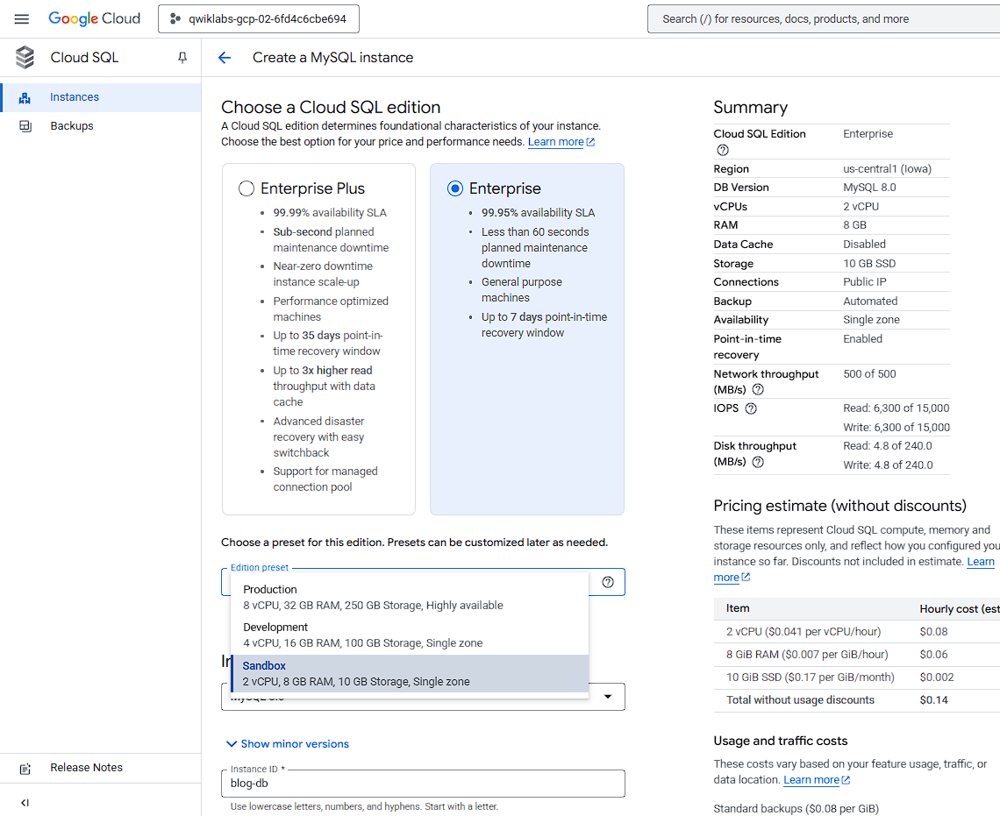
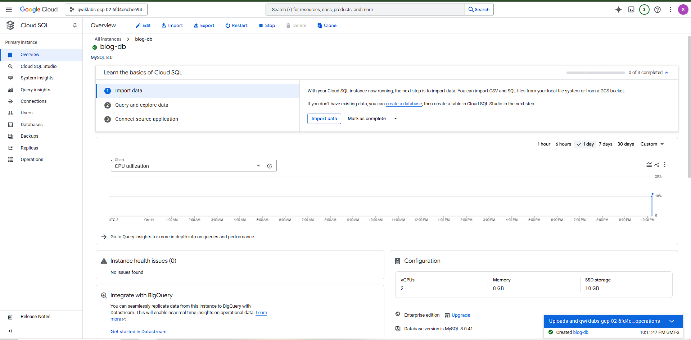
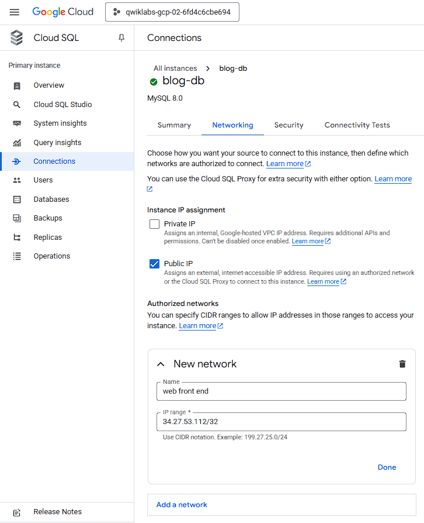
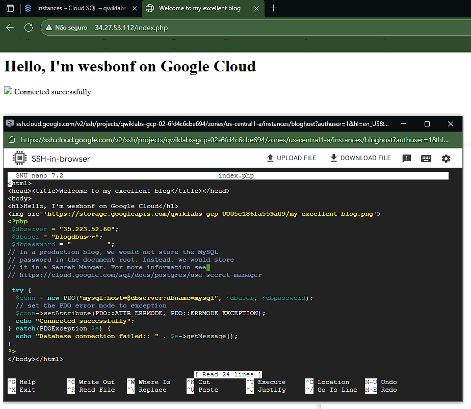

# ☁️ Google Cloud Fundamentals: Getting Started with Cloud Storage and Cloud SQL

Este repositório documenta o laboratório **"Google Cloud Fundamentals: Getting Started with Cloud Storage and Cloud SQL"**, realizado na **Google Cloud Skills Boost**.  
O objetivo foi compreender e aplicar os conceitos de **armazenamento**, **banco de dados** e **instâncias de computação** no **Google Cloud Platform (GCP)**.

---

## 🧠 Objetivos do Laboratório

- Criar um **bucket no Cloud Storage** e armazenar uma imagem pública.  
- Criar e configurar uma **instância do Cloud SQL (MySQL)**.  
- Implantar uma **VM no Compute Engine** com **Apache e PHP**.  
- Conectar a aplicação PHP ao **Cloud SQL**.  
- Exibir uma imagem hospedada no **Cloud Storage** em uma página web.  

---

## 🖥️ Instância Compute Engine - bloghost

Durante o laboratório foi criada uma instância de máquina virtual no **Google Compute Engine** com as seguintes especificações:

| Parâmetro | Valor |
|------------|--------|
| **Nome da instância** | `bloghost` |
| **Região** | `us-central1 (Iowa)` |
| **Zona** | `us-central1-a` |
| **vCPUs** | `2` |
| **Memória RAM** | `4 GB` |
| **Sistema Operacional** | `Debian GNU/Linux 12 (Bookworm)` |

## 🌐 Configuração de Rede

O **firewall HTTP** foi habilitado para permitir tráfego na porta **80**, possibilitando o acesso público à aplicação web.

| Configuração | Valor |
|---------------|--------|
| **Firewall** | HTTP traffic permitido |
| **Porta liberada** | 80 (TCP) |
| **Tipo de acesso** | Público |

## ⚙️ Automação de Inicialização (Startup Script)

Script executado automaticamente durante a criação da instância. Esse processo garante que o ambiente esteja pronto para execução de aplicações PHP.

## 🛰️ Resumo da Configuração de Rede da Instância

Após a criação da instância **bloghost**, a configuração de rede ficou da seguinte forma:

| Parâmetro | Valor |
|------------|--------|
| **Zona** | `us-central1-a` |
| **Endereço IP Interno** | `10.128.0.2` |
| **Endereço IP Externo (Público)** | `34.27.53.112` |

O IP **interno** é usado para comunicação privada entre recursos dentro da mesma VPC, enquanto o IP **externo** permite acesso público via navegador ou cliente HTTP.

---

## 🗄️ Criação do Banco de Dados Cloud SQL (MySQL)

Foi criada uma instância do **Cloud SQL** para hospedar o banco de dados **MySQL** utilizado pela aplicação PHP.  
A configuração utilizou a edição **Enterprise (Sandbox)**, adequada para testes e integração com o Compute Engine.

### ⚙️ Detalhes da Instância SQL

| Parâmetro | Valor |
|------------|--------|
| **Banco de Dados** | MySQL 8.0 |
| **Edição** | Enterprise |
| **Plano** | Sandbox |
| **vCPUs** | 2 |
| **Memória RAM** | 8 GB |
| **Armazenamento** | 10 GB |
| **Conexão** | IP Público |

---

## ✅ Criação do Cloud SQL Concluída com Sucesso

A instância do **Cloud SQL (MySQL 8.0)** foi criada com sucesso e está pronta para receber conexões da VM **bloghost**.  
Com isso, a integração entre **Compute Engine**, **Cloud SQL** e **Cloud Storage** foi concluída com êxito e configurado um usuário para ter acesso ao banco de dados

## 🔗 Configuração de Conexão do Cloud SQL

Para permitir que a VM **bloghost** acesse o banco de dados, foi configurada uma **conexão autorizada** no Cloud SQL utilizando o **IP público da instância**.  
O nome do acesso foi definido como **web front end**.

- **IP autorizado:** IP público da VM `bloghost`
- **Nome da conexão:** `web front end`

## 🌟 Teste Final da Aplicação Web

Após configurar a VM, o Cloud SQL e o Cloud Storage, a aplicação PHP foi executada com sucesso.  
A página web acessada via navegador exibiu:

- Título e mensagem de boas-vindas: **"Hello, I'm wesbonf on Google Cloud"**  
- Confirmação de conexão com o banco de dados: **"Connected successfully"**  

### 📸 Captura de Tela

