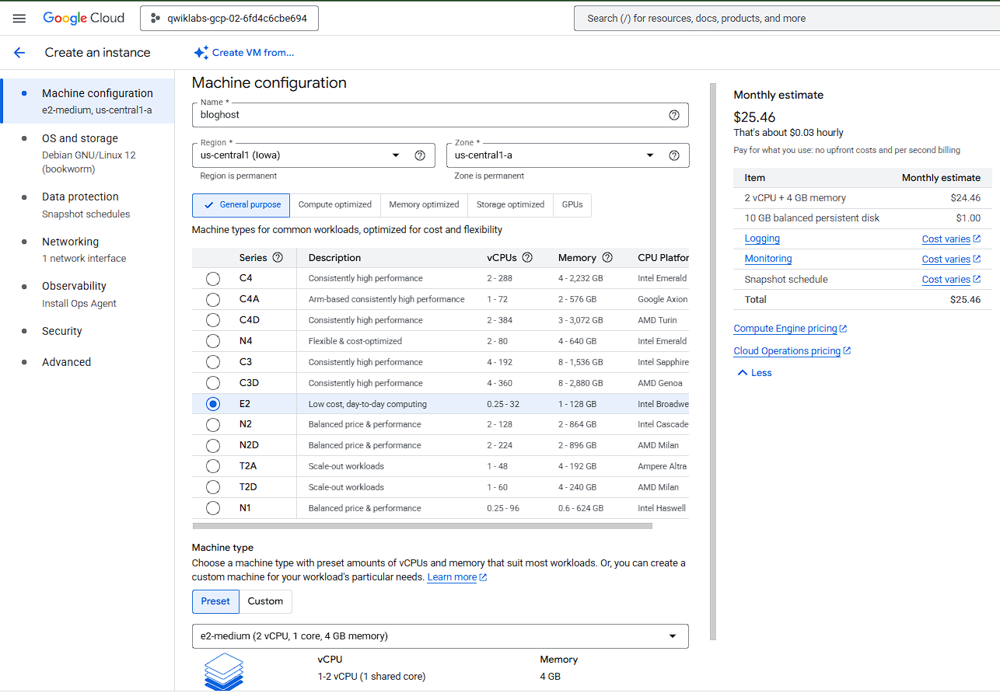
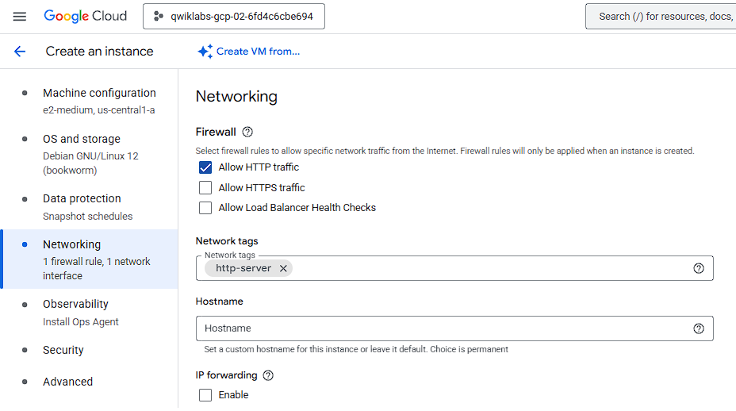
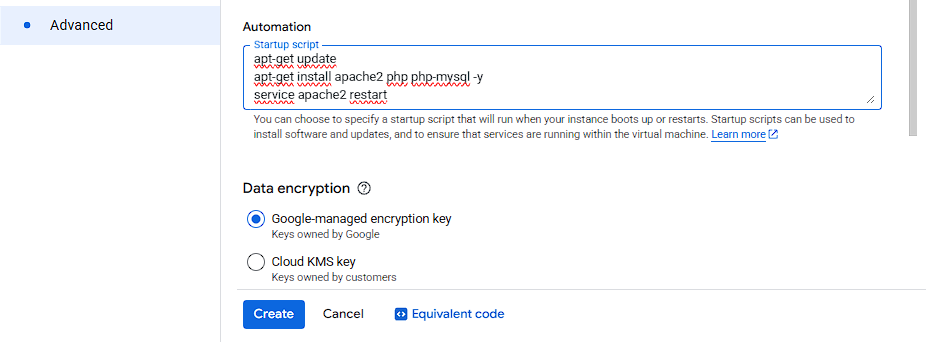
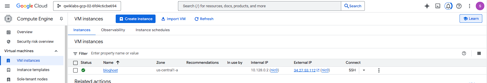

# ☁️ Google Cloud Fundamentals: Getting Started with Cloud Storage and Cloud SQL

Este repositório documenta a execução do laboratório **"Google Cloud Fundamentals: Getting Started with Cloud Storage and Cloud SQL"**, realizado na plataforma **Google Cloud Skills Boost**.  
O objetivo principal foi compreender e aplicar os conceitos fundamentais de **armazenamento, banco de dados e instâncias de computação** dentro do **Google Cloud Platform (GCP)**.

---

## 🧠 Objetivos do Laboratório

Durante o experimento, foram realizados os seguintes passos:

- ✅ Criar um **bucket no Cloud Storage** e armazenar uma imagem pública.  
- ✅ Criar e configurar uma **instância do Cloud SQL (MySQL)**.  
- ✅ Implantar uma **máquina virtual no Compute Engine** com **Apache e PHP**.  
- ✅ Conectar a aplicação PHP ao banco de dados do Cloud SQL.  
- ✅ Exibir uma imagem hospedada no Cloud Storage em uma página web.  

---

## 🖥️ Instância Compute Engine - bloghost

Durante o laboratório foi criada uma instância de máquina virtual no **Google Compute Engine** com as seguintes especificações:

| Parâmetro | Valor |
|------------|--------|
| **Nome da instância** | `bloghost` |
| **Região** | `us-central1 (Iowa)` |
| **Zona** | `us-central1-a` |
| **vCPUs** | `2` |
| **Memória RAM** | `4 GB` |
| **Sistema Operacional** | `Debian GNU/Linux 12 (Bookworm)` |

A instância foi configurada para executar o servidor **Apache2** e o interpretador **PHP**, utilizando o script de inicialização disponibilizado no laboratório.

## 🌐 Configuração de Rede

Durante a criação da instância **bloghost**, foi habilitada a opção de **Firewall** para permitir o tráfego **HTTP**.  
Essa configuração garante que o servidor web Apache possa ser acessado externamente através da porta **80**, permitindo o acesso público ao site hospedado.

| Configuração | Valor |
|---------------|--------|
| **Firewall** | HTTP traffic permitido |
| **Porta liberada** | 80 (TCP) |
| **Tipo de acesso** | Público |

## ⚙️ Automação de Inicialização (Startup Script)

Durante o processo de criação da instância **bloghost**, foi configurado um **Startup Script** responsável por instalar e iniciar automaticamente os serviços necessários para a aplicação web.  
Esse script garante que, ao iniciar a VM, o ambiente esteja pronto para hospedar aplicações PHP com suporte a banco de dados MySQL.

## 🛰️ Resumo da Configuração de Rede da Instância

Após a criação da instância **bloghost**, a configuração de rede ficou da seguinte forma:

| Parâmetro | Valor |
|------------|--------|
| **Zona** | `us-central1-a` |
| **Endereço IP Interno** | `10.128.0.2` |
| **Endereço IP Externo (Público)** | `34.27.53.112` |

O IP **interno** é utilizado para comunicação privada entre recursos dentro da mesma rede VPC, enquanto o IP **externo** permite o acesso público à instância via navegador ou cliente HTTP.

